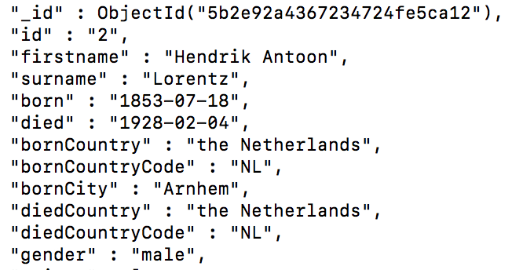

# Mongodb Basics 

### Overview:
* [Upload csvs/json into NoSQL database (MongoDB)](#upload)
* [Basic MongoDB queries](#basic)
    * [Comparison](#compare)
* [Complex Queries](#complex)
    * Geospatial
    * Text
    * Embedded Objects and Arrays
* [Query Optimization](#optimize)
    * Analyzing query time
    * Managing/creating indexes ([here](https://docs.mongodb.com/manual/indexes/))

<br>

`Note:`

>For today's lesson, we will be using a web version of MongoDB which you can find [here](https://www.tutorialspoint.com/mongodb_terminal_online.php). For future classes, you will should have MongoDB (and other NoSQL db we will use) already installed. Thank you :).
<!-- https://docs.mongodb.com/manual/tutorial/analyze-query-plan/ -->
<br><br>
<a id="upload"></a>
# Step 1: Upload files into MongoDB <br>

### Concepts:
* Get started on web MongoDB instance
* Import json/csv into Mongodb
* Navigating Mongo shell


First, in case you didn't, navigate to this link [here](https://www.tutorialspoint.com/mongodb_terminal_online.php). Here, we want to upload two different file types. The two files to upload are in the `data` folder which is inside the `week_1` folder. 
1. Upload those files to the online MongoDB instance by clicking on the left hand sidebar then right clicking on "root" folder and selecting upload.
2. Once uploaded, we now have to import those file types into MongoDB. To import these files we will use <strong> mongoimport </strong>.
> <strong> `Key Takeaway` </strong>
> <br> <strong>$ mongoimport</strong> is a utility used to easily and simply import files into MongoDB. Here we will only concern ourselves with the .json and .csv file formats

Execute the following commands to import the .csv and .json files respectively. `Note` - the 2 .json file types should exist in the same database (--db) because these two files are related. `All collections` (aka tables in SQL databases) should have different names.
 ```js
// To import .csv files
mongoimport --db [database_name] --collection [collection_name] --file [file_name] --headerline --type=[file_type] 

// To import .json files
mongoimport --jsonArray --db [database_name] --collection [collection_nam] --file [file_name]
```
#### Question - Using what you have above, how would you import the .csv and .json files?

<!-- mongoimport --jsonArray --db laureates --collection laureate --file laureates.json

mongoimport --jsonArray --db laureates --collection country --file country.json

mongoimport --db hr --collection sample --file sample_hr.csv --headerline --type=csv
 -->

3. Once you have successfully imported these files into you database, you can start your mongo shell running the following command `mongo`.
4. You have initiated your mongo shell, but you still have to navigate to your database you created in the above commands. 
 ```js
// Check all databases
show databases

// Navigate to a database
use database_name

// See collections (or tables in SQL)
show collections
```
This should return a list of all the collections you just created. Please first navigate to the database with the HR data. <br>

For clarity, the database with HR data, will be referred to as `hr_db` and its collection as `hr_c` and the other database as `laureates` and the collections as `laureates` and `country`.
<br>

Starting the next section, we will begin with the `hr_db`.

> #### Tips:
>* Use mongoimport & see --help if needed :)
>* Mongoimport is a powerful tool, and can quickly digest any file type. The file types most pertinent to this course are `.json` and `.csv` 
>* To learn more, visit this [link](https://docs.mongodb.com/manual/reference/program/mongoimport/).


<br><br>
<a id="basic"></a>
# Step 2: Basic Queries<br>

### Concepts 
* Learn basic MongoDB query methods:
    *  Projection, find, limit, where, sort, greater than/less than
<!-- * Do some exploratory queries -->


### SECTION 1: Greatest via Sorting

So the question for this section is:  
>####  Which Employee has the greatest number of years at the company? 
One way to address this question is to break it down into its substantive parts. The two main aspects are `greatest` and `years at the company`. 

Great, now that we have that background, lets attempt to solve this problem in MongoDB.

To do so, lets dive a bit deeper into how MongoDB is organized (we will explore this further in the reading/homework :)). In short, MongoDB is a document-oriented database. In other words, every input inside a collection (or table in a SQL db) is what is referred to as a `document` (or a row, in SQL). Moreover, documents can have `subdocuments` (or a join in SQL) which contain related data to the document as an array of some sort of values - but more on this later. 

> <strong>`Key Takeaway` </strong><br>
> Documents are amazing (clearly my unbiased opinion;) ). The key here is that all documents are a set of key-value pairs, where keys are represented as strings, and values are any basic data types such as numbers, strings, Booleans or data structures such as arrays or objects.

Now that you have some understanding of the document structure, <strong>what does the `years at the company` represent with respect to a document? </strong>

The basic construct of a query in MongoDB looks like this:
> `db.collection_name.find()`

This returns a list of documents from said collection. For this question, you will need a few method. 
> `$sort method` <br>
To execute this method, you must pass the sort method a key-value pair for it to sort on. To sort by ascending, the value of the key is 1, whereas to sort by descending the key is -1. In short, the general structure is <br>`query.sort({ key: value })`

#### Q: How would you write this query?


<!-- > db.hr.find().sort({ YearsAtCompany:-1 }).limit(1) -->

<br>

### SECTION 2: Projecting/Selecting Relevant Fields/Data
>#### Order by and `only` return the employees by Education and and MonthlyIncome. Order by both Education and MonthlyIncome.

Here you have two key methods you have to consider in constructing your query.
#### What are they?
<!-- 
* Order by = `sort`
* Only = ?
 -->

An important feature of this question is about selecting `only` the fields you want to return. To select only the fields you want to return in MongoDB, you specficy it within the query.
> `db.find( { }, { k1:v1, k2:v2, etc })`

Where k1 and k2 are keys and v1 and v2 are values. Here, again take notice of how we query the structure of the document database. In MongoDB, this kind of selecting of fields to return is called <strong> projection </strong>.  
<br><strong> Q: How does this query look like?</strong>    

<!-- 
db.hr.find({},{_id:0, Education:1, MonthlyIncome:1}).sort({Education:1, MonthlyIncome:1})    
-->
<br>
<br>

### SECTION 3: Comparison Operators
>#### Order by and `only` show all employees where the monthly income is at least 10000 and the job satisfaction is no greater than 3. Return the total number.

In this prompt, we have a whole new type of methods being subtly/implictly introduced. See here:
> `at least 10000 and [...] no greater than 3`

To address this phrase above, we will need to incoporate some comparison operators. See below for a list of them.

<a id="compare"></a>

#### --- Comparison Operators ---
<a id="comparison"></a>


Now that you have this list, the real question is, given this list, which comparison operator would you use to construct this query?

The second part of this query is returning the `total number` of items that fit this query. See below:
> db.query().`count()` <-- returns the count

Given you now have all the tools necessary to construct this query, how would you go about it?

<!-- db.hr.find({ MonthlyIncome: { $gte: 10000}, JobSatisfaction: {$lte: 2} }).count() -->

<!--  -->

<br>
<br>

>#### <strong>`Tips`</strong>:
>* Sort method has a 32mb size limitation on the resulting set being sorted. So, in larger collections, you may have to think about creating an [`index`](#index) to limit the number of documents MongoDB must scan. More on indexes later :). 

<br><br>

<a id="complex"></a> 

# Step 3: Complex Queries

### Concepts:
* [Query Embedded document & array](#embedded)
    * [What is an Embedded Document](#s1p1) 
    * [Querying Embedded Documents](#s1p2)
    * [Querying Arrays](#s1p3)
* [Text Search](#texts)
* [Geospatial Search](#geo)


>`Note: `<br>
Using `laureates` database for these problems. Please switch databases.

---
<br>

<a id="embedded"></a>
### SECTION 1: Query Embedded Document & Array

To query an embedded document, the first step is to understand some basic about what an embedded document is. 

<a id="s1p1"></a>
### Part 1 - What is an Embedded Document?
At a high level, an embedded document is exactly that - a document (which are what rows or inputs are called inside a collection i.e. model or table) embedded within another document. See the visual below:


As you can see above, there is an overarching document with name `"Joe Bookreader"`. Within this document, in the addresses field, there is an array with two inputs. These are referred to as `"Embedded documents"`. This type of data modeling is known as `Embedded data modeling`. 

>These schemas are generally known as `denormalized models` and main idea is to store related information in the same database record i.e. document.

Therefore, for cases like one to one or one to many relationships, NoSQL database architectures in MongoDB will often be designed in this style. This rich, flexible architecture is "denormalized" to fit related data wherein inputs could be very different as well i.e. maybe not every address has the same information. But what is the real purpose of using this structure? Well -

`Pros`:<br>*  Embedded documents provide much more efficent read operations
<br>* More efficient to query/request/retrieve all related data in a SINGLE database operations 
<br>* Good for modeling `1-to-1` or `1-to-Many` relationships
<br>`Cons`:
<br>* Embedded entities perform poorly with frequent updates 
<br>* Embedded entities have size limits restricted by document size
<br> * Can't handle `Many-to-Many` relationships efficiently


 This stands at the opposite side of the spectrum to what is known as the `normalized model` of database architecture, which is commonly seen in SQL database architecture. See image below:


 
 As seen above, the normalized data model is just the opposite of the denormalized model. In short, this data model assigns references (foreign keys) to the User document in two separate documents within two separate collections, the Contact and Access collection respectively.

`Pros`:<br>* Easier to represent complex many-to-many relationships
<br>* Read and Write performance sufficiently faster 
<br>* Documents have a size limit of 16MBs - so if your embedded document may continuously grow, better to make it a separate collection
<br> *  Maintains integrity of data
<br>`Cons`:
<br>* A normalized structure as such (a flat structure) will tend to require multiple or more complex, time-consuming queries to resolve the references


<strong> Embedding:</strong>
* You have small subdocuments
* Your data does not need to change regularly
* You don’t need immediate consistency ( not up-to-date )
* Your documents grow by a small amount
* You need this data to perform a second query
* You want faster reads
<br/>

<strong>Referencing:</strong>
* You have large subdocuments
* Your data changes frequently
* You need your data to be up-to-date
* Your documents grow by a large amount
* Your data is often excluded from your results
* You want faster writes

Part of the question here is an architectural decision. The question being:
>#### <strong><p align="center">Which do you need more - `speed or consistency?` </p></strong>

This statement might seem rhetorical, but from an architectural standpoint, it's an important  question. There are cases in which `denormalization` can lead to data inconsistency, while `normalization` can lead to greater query latency which in turn decreases the efficiency of the read operation.

<!-- Another example of denormalization is used are Lucene and Solr, like MongoDB, they also adopted document model, actually it's very natural to use MongoDB as data storage and use Lucene or Solr as searching analyzing and index building for the data. -->

Normalization makes your data compact, easy to store and easy to achieve consistency but with low query performance and hard to scale horizontally, denormalization provide high performance query but may cause data inconsistency.

> <strong>Question</strong>:<br>
> if you had to guess, what do you think a fast, efficient search index system like Solr or Lucerne do?  

<a id="s1p2"></a>
### Part 2 - Querying an Embedded Document

To query this unique, denormalized data model, the basic syntax is as follows:

```js
db.query({"`embedded_document.field`": value})
```

Now that you have the basics of how to query an embedded document and some udnerstanding of what it is, try the following exercises. All of them are using the `laureates` database.

* #### How many laureates laureates have won it in the physics category? (ex.1)
<!-- db.laureates.find({'prizes.category':"physics"}).count() -->

* #### How many laureates laureates have won it in the chemistry category after the year 1910? Sort by year descending.(ex.2)
<!-- db.laureates.find({'prizes.category':"chemistry", 'prizes.year': {$gt:"1910"}}).sort({"prizes.year": -1}).limit(5) -->


* #### How many laureates laureates have won it in the physics category where the affiliation country is France? (ex.3)
<!-- db.laureates.find({'prizes.category':"chemistry", 'prizes.affiliations.country': "France" }).count() -->

* #### List all the [`distinct`](https://docs.mongodb.com/manual/reference/method/db.collection.distinct/) affiliation countries are there for laureates prize winners? (ex.4)

<!-- db.laureates.distinct('prizes.affiliations.country')  -->


<a id="s1p2"></a>
### Part 3 - Querying Arrays

Now, with the `laureates` database, we will query arrays. If you are coming from a SQL/relational backgorund, this might seem unnatural, but lets try a few out. 
<br>
<br>
Before we begin, lets do a bit of discovery. 

1 - <strong>How Many fields are there? Return a list of only the fields (not their values). </strong> 
<br/> `Key` thing to remember here is that everything in MongoDB is a document, which is just an object. What's an object? Well, for simplicity, an object is just a container for properties which are just name - value pairs. In our `nobel` database, for example the `names` are on the left, and `values` on the right. See below:



<strong> Can you pick out a name value pair? </strong>
<!-- Object.keys(db.nobel.findOne()).length, 
Object.keys(db.nobel.findOne()) -->

With this, can you return only the keys of a single document? There are several ways of doing this (as with everything, in code :) ). In short, here are the ways:
* Query database for a document and manually count
* Treat a document as an object and only grab its `keys` by using the Object.keys() method (this is the more readable way, if you were producing a report)
<br>

>`Note`:<br> Since not all documents in a collections have the same structure (MongoDB is schemaless), you cant find out all the field names for a collection, only a particular document. Therefore, the output will not be representative of what every document's structure is but will tend to give a general understanding of how the documents in a collection are structure
<br>


2 - <strong>How Many distinct fields are there for the array field? What are they? </strong> (ex.2)
<!-- db.nobel.distinct("new_array").length, db.nobel.distinct("new_array") -->
Using distinct, how would you return all the unique values for the array field? Which is the field that has an array of values?

<br>

3 - <strong> Querying Arrays </strong>
<br> Now with better understanding of the collections and arrays, lets have a look at how to query array fields.

In MongoDB, some use cases might include fields such as tags, years, colors, etc. Can you think of some?

Several formats of querying an array: equality condition, at least one, and multiple criteria condition


<strong>Part 1 - Equality </strong>:
<br>There are two types of equality conditions. One where order is maintained and one where it is not. See below.

```js
// Order maintained
db.query({"arrayField": [value1, value2]})

// Order not maintained. Use $all operator.
db.query({arrayField: { "$all": [value1, value2]} })
```

Try the problem below: <br>
<br>
<strong>How many documents contain the value `crimson`? How many have exactly `crimson` and `kiwi`? </strong>  

<!-- only finds exact -->
<!-- db.nobel.find( { "new_array": {$all:["crimson"] } }),

db.nobel.find( { "new_array": ["crimson","kiwi"] } ) 
-->

What differences do you notice? 


<br><strong>Part 2 - At Least One </strong>:
<br>To specify having only one of the values in the array, use the following format:
```js
db.query({"arrayField": value1 })
```

Now answer the following:

<strong>How many documents contain the value `indigo`? How many have either `crimson` or `indigo`? </strong>  

For the second question, you have to use the `$or` operator to combine the both options. The  implementation for `$or` is as follows:
<br>
```js
db.query({"$or": [{field:value}, {field:value}, ... ]})
```

In addition, another way of writing attempting solve this question is by using the `$in` operator. The implementation is as follows:
<br>
```js
db.nobel.find( { field: {"$in": ["value1","value2",...] }} )
```

The `$in` operator like the `$or` operator checks for either of the values. In general, the two will be substitutes for one another.  
<!-- db.nobel.find( { "new_array":"indigo" } ).count(),
db.nobel.find({$or: [{ "new_array":"indigo" }, {new_array:"crimson"}]} ).count(),
db.nobel.find( { "new_array":{$in: ["indigo","crimson"] }} ).count() -->

How would you solve this? Remember to use the or operator to include both conditions in your total count.

<br>
4 - <strong> Advanced Array Querying </strong>

Here, we will try and combine some of the earlier concepts with some comparison queries to build more complex queries. 

In the last section, you identified all the different attributes of a document in the `nobel` collection. In this part 4 of querying arrays, we will examine more closely how to construct queries built on top of some comparison operators.

To match on multiple criteria, use `$elemMatch` operator. Here's an example implementation:
<br>
```js
db.nobel.find( { new_score_array: { "$elemMatch": { $gt: 1, $lt: 10 } } } )
```

What results are returned ? Are they different that the ones you expected?

Try it with other comparison operators [(see above)](#comparison). 

Last but not least is the `$size` operator. This is used to query based on array sizes.

```js
db.query( { field: { `$size`: number_value} })
```

`Note` - $size operator DOES NOT accept range operators. Can you explain what this means?

<strong>Challenge </strong><br>
That being said, how would you construct a query to include all documents with array sizes no larger than 2?

<!-- db.nobel.find( {$or: [{ new_score_array: { $size: 0} }, { new_score_array: { $size: 1} }, { new_score_array: { $size: 2} } ]} ).count() -->

<br> 


<a id="texts"></a>
### SECTION 2: Text Search
<br>
One of the powerful features in MongoDB is the ability to do a text search through any field that you have indexed whose value is a text field. Lets have a closer look at what this entails.

In the `nobel` collection, the `prizes.motivation` field tends to be a text field describing the motivation behind each awarded nobel prize. This seems like a good candidate to have a text search on. This is a two step process:
1. Create and index on the field you want to search
2. Run query on said field

To create an index (more on this in [Step 4](#step4)), use the following syntax:<br>
```js
db.stores.`createIndex`( { field_name: value, field_name: value } )
```

How would you accomplish this for our collection?
<!-- db.nobel.createIndex( { "prizes.motivation": "text" } ) -->

Now that you have created an index, specifying the field to search, the syntax for a text seach is as follows:<br>
```js
db.nobel.find({"$text": {"$search": "text_to_search" }})
```

How would you answer the following?<br>
><strong>How many documents contain the word `radiation`? How many contain the words `radiation, isolation and radiation`?</strong>  

The `$text` operator is a powerful tool, and can be used with many modifications.  

In addition, as part of the `$text` operator, we can also reveal how well the document matched with the search term/terms. This score is given to all the documents and can be sorted by this score as well to retrieve the most relevant documents. 

Here's an example of its implementation:
```js
 db.nobel.find(    { $text: { $search: "search_terms" } },    { score: { $meta: "textScore" } } ).sort( { score: { $meta: "textScore" } } )
 ```

 This will sort the documents  by their `textScore`, which is a measure of how relevant the specified text indexed is to the search terms you queried on. 

 The `$text` operator can also `exclude` documents that contain a certain term. To accomplish this, the syntax is  " `-search_term`". If it helps, think of it as negating or "minus" this search_term. 

><strong>Challenge </strong> <br>
What is the difference in documents returned between text `containing radiation` and those containing radiation `but not cosmic`?
<!-- db.nobel.find(    { $text: { $search: "radiation -cosmic" } },    { score: { $meta: "textScore" } } ).sort( { score: { $meta: "textScore" } } ).count()
 db.nobel.find(    { $text: { $search: "radiation" } },    { score: { $meta: "textScore" } } ).sort( { score: { $meta: "textScore" } } ).count()
 -->

Also, it is important to note that match operation of the $text operator has several unique conditions.
* Stop words are ignored such as his, her, by, the, a, and, etc. If you want to see the full list, see [here](https://github.com/Yoast/YoastSEO.js/blob/develop/src/config/stopwords.js) or [here](https://www.ranks.nl/stopwords) for stop words in other languages.
* Unless specified otherwise, the $text operator matches on the complete `stemmed word`. To see more on stemmed words, click [here](https://en.wikipedia.org/wiki/Stemming).

For more on the `$text` operator and all its functionality, see [MongoDB docs](https://docs.mongodb.com/manual/reference/operator/query/text/).


<a id="geo"></a>
### SECTION 3: Geospatial Search

For this section we will switch to our `country` collection to conduct `geospatial` queries.

Geospatial queries are an interesting type of native query for MongoDB. To create a geospatial index there are 3 key factors:
1. Need a field that holds a location, stored as an array, with an `x` and `y` value.
2. Need to create an index on the relevant field with `$createIndex`.
3. To execute the query, use the `$near` operator.


How would you create an index and around what field value?
<!-- db.cities.createIndex( { "loc": "2dsphere" } )  -->

After creating an index, it's time to use the `$near` operator. The syntax of the `$near` operator also includes min and max distance properties, `$minDistance` and `$maxDistance` respectively. See the syntax below:
```js
// Required syntax below to execute a geospatial query
 db.collection.find({ loc: {`$near`: { $geometry: {type: "Point", coordinates: [ x, y]}, `$minDistance`: min_distance, `$maxDistance`:max_distance }  }  })
 ```

><strong>Challenge</strong><br>
Return the number of cities near coordinates [-72.622739, 42.070206] with a min distance of 0 and max distance of 10000.
<!-- db.cities.find({ loc: {$near: { $geometry: {coordinates: [ -72.622739, 42.070206]}, $minDistance: 100, $maxDistance:10000 }  }  }) -->

Another facet of the geospatial index is the `$geoNear` command. `$geoNear` sorts documents in terms of distance (in meters) from nearest to farthest to a specified point, assuming a 2d sphere i.e. earth-like sphere. Similar to the last query, you can set a min and max distance. Quite different from the last query, `$geoNear` returns the actual distance from a specified point in meters. In addition, $geoNear returns stats on your query, the most important being:
* Average distance and Max distance of documents returned
* Time in miliseconds the query took
<br>
<br>

The implementation for `$geoNear` is as follows:
```js
// Required syntax below to execute a geospatial query
 db.runCommand( { `geoNear`: collection_name, `near`: {coordinates: [x, y ] }, spherical: boolean, limit: option, query: option, minDistance: min, maxDistance: max...} )
 ```
Now lets try a problem using the $geoNear command.

><strong>Challenge</strong><br>
Find all the cities near the coordinates -72.622739, 42.070206. Execute it. Then execute it by limiting the number of documents using the following limits: 30, 20, 10. Do you notice anything interesting?
<!-- db.runCommand(    {      geoNear: "cities",      near: {coordinates: [ -72.622739, 42.070206 ] },      spherical: true, limit: 10} ) -->

### See Below for more reading:

><strong>`References/Read More`</strong>: 
>* [Query Array](https://docs.mongodb.com/manual/tutorial/query-arrays/)
>* [Query Embedded document](https://docs.mongodb.com/manual/tutorial/query-embedded-documents/)
>* More on [Embedded documents vs separate collections](http://openmymind.net/Multiple-Collections-Versus-Embedded-Documents/#1)
>* Tons of resources here: [Embed vs Ref](https://coderwall.com/p/px3c7g/mongodb-schema-design-embedded-vs-references), [Tips and Tricks](https://www.safaribooksonline.com/library/view/50-tips-and/9781449306779/ch01.html#tip_5), [MongoDB Schema Design Series Pt.1](https://www.mongodb.com/blog/post/6-rules-of-thumb-for-mongodb-schema-design-part-1)
>* More on querying Arrays [here](https://docs.mongodb.com/v3.2/reference/operator/query-array/)
>* More on advanced topics on geospatial queries and polygon arrays [here](https://docs.mongodb.com/manual/reference/geojson/#geojson-polygon)
>* For more on Geospatial queries, see [here](https://docs.mongodb.com/manual/reference/operator/query-geospatial/index.html) and [here](https://docs.mongodb.com/manual/geospatial-queries/) and for more on `$geoNear`, click [here](https://docs.mongodb.com/manual/reference/command/geoNear/)
>* For more on logical operators such as `$or`, see [here](https://docs.mongodb.com/manual/reference/operator/query-logical/)
>* For more on evaluation queries such as the `$text` operator, see [here](https://docs.mongodb.com/manual/reference/operator/query-evaluation/)


<br>

---
<br>
<a id="optimize"></a>
<a id="step4"></a>

## Step 4: Query Optimization<br>

#### Concepts:
* [Execution stats](#stats)
* [Complex Indexes](https://docs.mongodb.com/manual/reference/method/db.collection.createIndex/) - multiple indexes, order
* [Other topics](#other) 


<a id="stats"></a>

### SECTION 1: Execution Stats


<a id="index"></a>

### SECTION 2: Indexes


<a id="other"></a>

### SECTION 3: Otherz
[Latency](https://docs.mongodb.com/manual/reference/method/db.collection.latencyStats/)