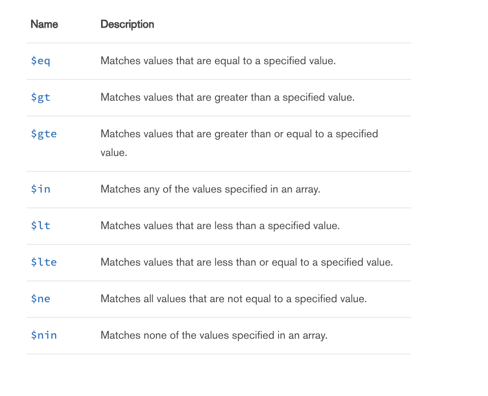
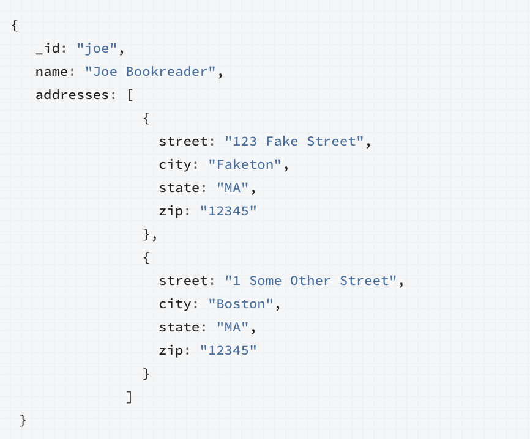
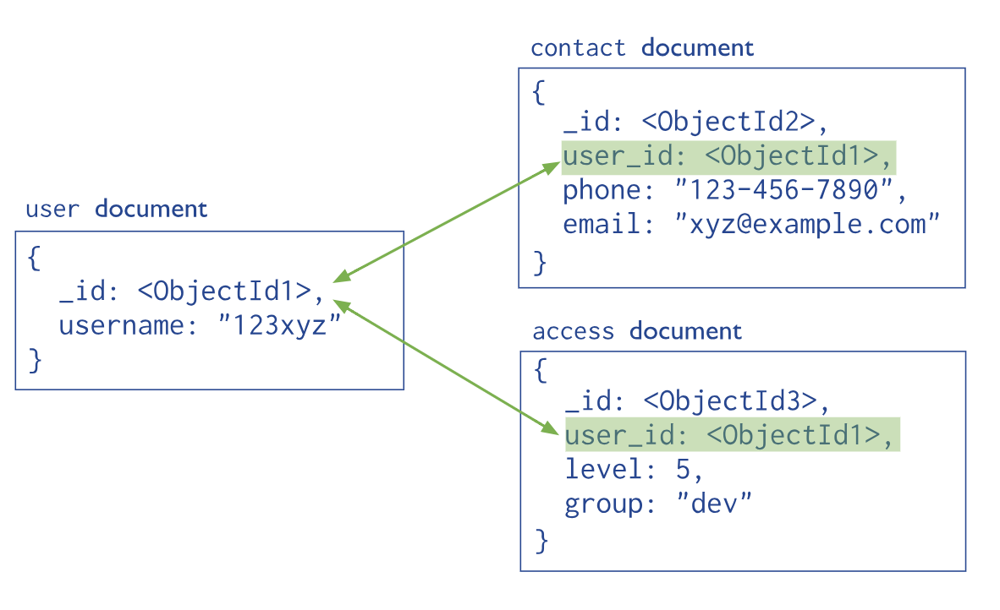

# Mongodb Basics 

### Overview:
* [Upload csvs/json into NoSQL database (MongoDB)](#upload)
* [Basic MongoDB queries](#basic)
    * [Comparison](#compare)
* [Complex Queries](#complex)
    * Geospatial
    * Text
    * Embedded Objects and Arrays
* [Query Optimization](#optimize)
    * Analyzing query time
    * Managing/creating indexes ([here](https://docs.mongodb.com/manual/indexes/))

<br>

`Note:`

>For today's lesson, we will be using a web version of MongoDB which you can find [here](https://www.tutorialspoint.com/mongodb_terminal_online.php). For future classes, you will should have MongoDB (and other NoSQL db we will use) already installed. Thank you :).
<!-- https://docs.mongodb.com/manual/tutorial/analyze-query-plan/ -->
<br><br>
<a id="upload"></a>
# Step 1: Upload files into MongoDB <br>

### Concepts:
* Get started on web MongoDB instance
* Import json/csv into Mongodb
* Navigating Mongo shell


First, in case you didn't, navigate to this link [here](https://www.tutorialspoint.com/mongodb_terminal_online.php). Here, we want to upload two different file types. The two files to upload are in the `data` folder which is inside the `week_1` folder. 
1. Upload those files to the online MongoDB instance by clicking on the left hand sidebar then right clicking on "root" folder and selecting upload.
2. Once uploaded, we now have to import those file types into MongoDB. To import these files we will use <strong> mongoimport </strong>.
> <strong> `Key Takeaway` </strong>
> <br> <strong>$ mongoimport</strong> is a utility used to easily and simply import files into MongoDB. Here we will only concern ourselves with the .json and .csv file formats

Execute the following commands to import the .csv and .json files respectively. `Note` - the 2 .json file types should exist in the same database (--db) because these two files are related. `All collections` (aka tables in SQL databases) should have different names.
 ```js
// To import .csv files
mongoimport --db [database_name] --collection [collection_name] --file [file_name] --headerline --type=[file_type] 

// To import .json files
mongoimport --jsonArray --db [database_name] --collection [collection_nam] --file [file_name]
```
#### Question - Using what you have above, how would you import the .csv and .json files?

<!-- mongoimport --jsonArray --db nobel --collection laureate --file laureates.json

mongoimport --jsonArray --db nobel --collection country --file country.json

mongoimport --db hr --collection sample --file sample_hr.csv --headerline --type=csv
 -->

3. Once you have successfully imported these files into you database, you can start your mongo shell running the following command `mongo`.
4. You have initiated your mongo shell, but you still have to navigate to your database you created in the above commands. 
 ```js
// Check all databases
show databases

// Navigate to a database
use database_name

// See collections (or tables in SQL)
show collections
```
This should return a list of all the collections you just created. Please first navigate to the database with the HR data. <br>

For clarity, the database with HR data, will be referred to as `hr_db` and its collection as `hr_c` and the other database as `nobel` and the collections as `laureates` and `country`.
<br>

Starting the next section, we will begin with the `hr_db`.

> #### Tips:
>* Use mongoimport & see --help if needed :)
>* Mongoimport is a powerful tool, and can quickly digest any file type. The file types most pertinent to this course are `.json` and `.csv` 
>* To learn more, visit this [link](https://docs.mongodb.com/manual/reference/program/mongoimport/).


<br><br>
<a id="basic"></a>
# Step 2: Basic Queries<br>

### Concepts 
* Learn basic MongoDB query methods:
    *  Projection, find, limit, where, sort, greater than/less than
<!-- * Do some exploratory queries -->


### SECTION 1: Greatest via Sorting

So the question for this section is:  
>####  Which Employee has the greatest number of years at the company? 
One way to address this question is to break it down into its substantive parts. The two main aspects are `greatest` and `years at the company`. 

Great, now that we have that background, lets attempt to solve this problem in MongoDB.

To do so, lets dive a bit deeper into how MongoDB is organized (we will explore this further in the reading/homework :)). In short, MongoDB is a document-oriented database. In other words, every input inside a collection (or table in a SQL db) is what is referred to as a `document` (or a row, in SQL). Moreover, documents can have `subdocuments` (or a join in SQL) which contain related data to the document as an array of some sort of values - but more on this later. 

> <strong>`Key Takeaway` </strong><br>
> Documents are amazing (clearly my unbiased opinion;) ). The key here is that all documents are a set of key-value pairs, where keys are represented as strings, and values are any basic data types such as numbers, strings, Booleans or data structures such as arrays or objects.

Now that you have some understanding of the document structure, <strong>what does the `years at the company` represent with respect to a document? </strong>

The basic construct of a query in MongoDB looks like this:
> `db.collection_name.find()`

This returns a list of documents from said collection. For this question, you will need a few method. 
> `$sort method` <br>
To execute this method, you must pass the sort method a key-value pair for it to sort on. To sort by ascending, the value of the key is 1, whereas to sort by descending the key is -1. In short, the general structure is <br>`query.sort({ key: value })`

#### Q: How would you write this query?


<!-- > db.hr.find().sort({ YearsAtCompany:-1 }).limit(1) -->

<br>

### SECTION 2: Projecting/Selecting Relevant Fields/Data
>#### Order by and `only` return the employees by Education and and MonthlyIncome. Order by both Education and MonthlyIncome.

Here you have two key methods you have to consider in constructing your query.
#### What are they?
<!-- 
* Order by = `sort`
* Only = ?
 -->

An important feature of this question is about selecting `only` the fields you want to return. To select only the fields you want to return in MongoDB, you specficy it within the query.
> `db.find( { }, { k1:v1, k2:v2, etc })`

Where k1 and k2 are keys and v1 and v2 are values. Here, again take notice of how we query the structure of the document database. In MongoDB, this kind of selecting of fields to return is called <strong> projection </strong>.  
<br><strong> Q: How does this query look like?</strong>    

<!-- 
db.hr.find({},{_id:0, Education:1, MonthlyIncome:1}).sort({Education:1, MonthlyIncome:1})    
-->
<br>
<br>

### SECTION 3: Comparison Operators
>#### Order by and `only` show all employees where the monthly income is at least 10000 and the job satisfaction is no greater than 3. Return the total number.

In this prompt, we have a whole new type of methods being subtly/implictly introduced. See here:
> `at least 10000 and [...] no greater than 3`

To address this phrase above, we will need to incoporate some comparison operators. See below for a list of them.

<a id="compare"></a>

#### --- Comparison Operators ---



Now that you have this list, the real question is, given this list, which comparison operator would you use to construct this query?

The second part of this query is returning the `total number` of items that fit this query. See below:
> db.query().`count()` <-- returns the count

Given you now have all the tools necessary to construct this query, how would you go about it?

<!-- db.hr.find({ MonthlyIncome: { $gte: 10000}, JobSatisfaction: {$lte: 2} }).count() -->

<!--  -->

<br>
<br>

>#### <strong>`Tips`</strong>:
>* Sort method has a 32mb size limitation on the resulting set being sorted. So, in larger collections, you may have to think about creating an [`index`](#index) to limit the number of documents MongoDB must scan. More on indexes later :). 

<br><br>

<a id="complex"></a> 

# Step 3: Complex Queries

### Concepts:
* [Query Embedded document & array](#embedded) 
* [Geospatial Search](#geo)
* [Text Search](#texts)

>`Note: `<br>
Using `Nobel` database for these problems. Please switch databases.

### SECTION 1: Query Embedded Document & Array

To query an embedded document, the first step is to understand some basic about what an embedded document is. 

At a high level, an embedded document is exaactly that - a document (which are what rows or inputs are called inside a collection i.e. model or table) embedded within another document. See the visual below:



As you can see above, there is an overarching document with name `"Joe Bookreader"`. Within this document, in the addresses field, there is an array with two inputs. These are referred to as `"Embedded documents"`. This type of data modeling is known as `Embedded data modeling`. 

>These schemas are generally known as `denormalized models` and main idea is to store related information in the same database record.

Therefore, for cases like one to one or one to many relationships, NoSQL database architectures in MongoDB will often be designed in this style. This rich, flexible architecture is "denormalized" to fit related data wherein inputs could be very different as well i.e. maybe not every address has the same information. But what is the real purpose of using this structure? Well -

`Pros`:<br>*  Embedded documents provide much more efficent read operations
<br>* More efficient to query/request/retrieve all related data in a SINGLE database operations 
<br>* Good for modeling `1-to-1` or `1-to-Many` relationships
<br>`Cons`:
<br>* Embedded entities perform poorly with frequent updates 
<br>* Embedded entities have size limits restricted by document size


 This stands at the opposite side of the spectrum to what is known as the `normalized model` of database architecture, which is commonly seen in SQL database architecture. See image below:


 
 As seen above, the normalized data model is just the opposite of the denormalized model. In short, this data model assigns references (foreign keys) to the User document in two separate documents within two separate collections, the Contact and Access collection respectively.

`Pros`:<br>* Easier to represent complex many-to-many relationships
<br>* Read and Write performance sufficiently faster 
<br>* Documents have a size limit of 16MBs - so if your embedded document may continuously grow, better to make it a separate collection
<br> *  Maintains integrity of data
<br>`Cons`:
<br>* A normalized structure as such (a flat structure) will tend to require multiple or more complex, time-consuming queries to resolve the references


<strong> Embedding:</strong>
* You have small subdocuments
* Your data does not need to change regularly
* You don’t need immediate consistency ( not up-to-date )
* Your documents grow by a small amount
* You need this data to perform a second query
* You want faster reads
<br/>

<strong>Referencing:</strong>
* You have large subdocuments
* Your data changes frequently
* You need your data to be up-to-date
* Your documents grow by a large amount
* Your data is often excluded from your results
* You want faster writes

>#### <strong>`Tips`</strong>:
>#### <strong>`References/Read More`</strong>:
>* [Query Array](https://docs.mongodb.com/manual/tutorial/query-arrays/)
>* [Query Embedded document](https://docs.mongodb.com/manual/tutorial/query-embedded-documents/)
>* More on [Embedded documents vs separate collections](http://openmymind.net/Multiple-Collections-Versus-Embedded-Documents/#1)


<a id="optimize"></a>

# Step 4: Query Optimization<br>

#### Concepts:
* Execution stats
* [Complex Indexes](https://docs.mongodb.com/manual/reference/method/db.collection.createIndex/) - multiple indexes, order
* [Latency](https://docs.mongodb.com/manual/reference/method/db.collection.latencyStats/)


#### Unit Questions:
* Questions 
#### Tips:
* Tips for population